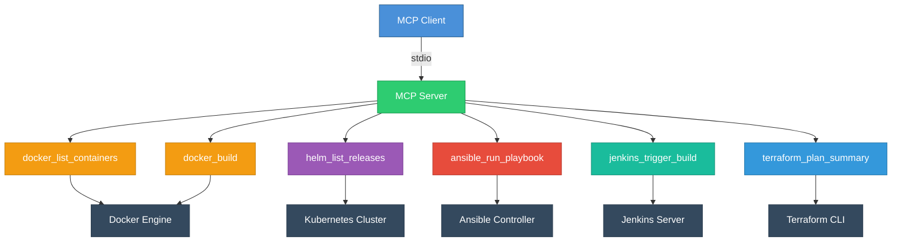

# mcp-server-devops

An MCP (Model Context Protocol) server providing tools for common DevOps operations. Integrates with Docker, Helm, Ansible, Jenkins, and Terraform through a unified interface.

## Architecture



## Tools

| Tool | Description |
|------|-------------|
| `docker_list_containers` | List Docker containers with status filtering |
| `docker_build` | Build Docker images from a Dockerfile |
| `helm_list_releases` | List Helm releases across namespaces |
| `ansible_run_playbook` | Execute Ansible playbooks with variable support |
| `jenkins_trigger_build` | Trigger Jenkins build jobs with parameters |
| `terraform_plan_summary` | Run terraform plan and return structured summaries |

## Installation

```bash
npm install
npm run build
```

## Usage

### As a standalone server

```bash
npm start
```

### With Docker

```bash
docker build -t mcp-server-devops .
docker run -i --rm mcp-server-devops
```

### MCP Client Configuration

```json
{
  "mcpServers": {
    "devops": {
      "command": "node",
      "args": ["dist/index.js"],
      "cwd": "/path/to/mcp-server-devops"
    }
  }
}
```

## Development

```bash
npm run dev
npm run lint
npm run clean
```

## Requirements

- Node.js >= 18
- Docker CLI (for Docker tools)
- Helm CLI (for Helm tools)
- Ansible (for Ansible tools)
- Terraform CLI (for Terraform tools)
- Jenkins API access (for Jenkins tools)

## License

MIT License - see [LICENSE](LICENSE) for details.
